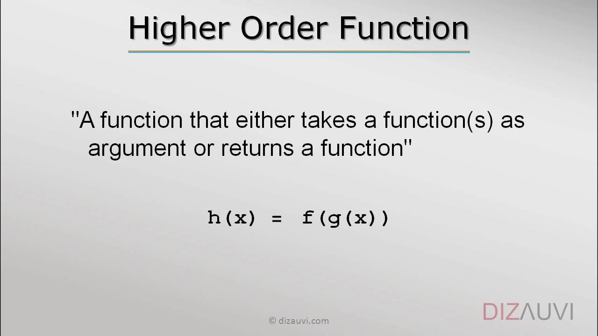

Function Exercises

Implement all of the following problems without using a while or a for loop unless you were explicitly asked to use loops.

Positive Numbers

Write a function which takes an array of numbers as input and returns a new array containing only the positive numbers in the given array.

Even Numbers

Write a function which takes an array of numbers as input and returns a new array containing only the even numbers in the given array.

Square the Numbers

Write a function which takes an array of numbers as input and returns a new array containing result of squaring each of the numbers in the given array by two. Example: squareTheNumbers([1, 2, 3]) should give [1, 4, 9].

Cities 1

Write a function which takes an array of city objects like such:

var cities = [
  { name: 'Los Angeles', temperature: 60.0},
  { name: 'Atlanta', temperature: 52.0 },
  { name: 'Detroit', temperature: 48.0 },
  { name: 'New York', temperature: 80.0 }
];
as input and returns a new array containing the cities whose temperature is cooler than 70 degrees.

Cities 2

Write a function which takes an array of city objects like the above problem as input and returns an array of the cities names.

Good Job!

Given an array of people's names:

var people = [
  'Dom',
  'Lyn',
  'Kirk',
  'Autumn',
  'Trista',
  'Jesslyn',
  'Kevin',
  'John',
  'Eli',
  'Juan',
  'Robert',
  'Keyur',
  'Jason',
  'Che',
  'Ben'
];
Print out 'Good Job, {{name}}!' for each person's name, one on a line.

Sort an array

Given an array of strings such the array of names given in the previous problem, sort them by alphabetically order.

Sort an array, 2

Sort the same array, but not by alphabetically order, but by how long each name is, shortest name first.

Sort an array, 3

Given an array of array of numbers like:

var arr = [
  [1, 3, 4],
  [2, 4, 6, 8],
  [3, 6]
];
Sort the array by the sum of each inner array. For the above example, the respective sums for each inner array is 8, 20, and 9. Therefore, the solution should be:

[
  [1, 3, 4],
  [3, 6],
  [2, 4, 6, 8]
]
3 times

Given this function:

function call3Times(fun) {
  fun();
  fun();
  fun();
}
Use the call3Times function to print "Hello, world!" 3 times.

n times

You will write a function callNTimes that takes two arguments: times as a number, and fun as a function. It will call that function for that many times. Example:

> callNTimes(5, hello)
Hello, world!
Hello, world!
Hello, world!
Hello, world!
Hello, world!
You are allowed to use a loop in the implementation of callNTimes.

Sum an array

Write a function sum that takes an array of numbers as argument and returns the sum of those numbers. Use the reduce method to do this.

> sum([1, 2, 3])
6
Acronym

Write a function acronym that takes an array of words as argument and returns the acronym of the words. Use the reduce method to do this.

> acronym(['very', 'important', 'person'])
'VIP'
> acronym(['national', 'aeronautics', 'space', 'administration'])
'NASA'
Bonus: forEach

Implement a forEach function which takes two arguments: an array arr and a function fun. It will call fun passing each item in arr to fun as the first argument. Example:

var arr = [
  { name: 'Bob' },
  { name:'Alice' },
  { name:'Joe' }];
forEach(arr, function(person) {
  console.log('Hello, ' + person.name + '!');
});
The above program will print:

Hello, Bob!
Hello, Alice!
Hello, Joe!
You can use a loop in the implementation of this function.

Bonus: map

Implement a map function which takes two arguments: an array arr and a function fun. It will return a new array, with each of its results being the result of calling fun with argument

Closure Exercises

Counter

Make a counter function that returns a function that returns a successive number each time it is called.

> var count1 = counter()
> var count2 = counter()
> count1()
1
> count1()
2
> count2()
1
> count2()
2
> count1()
3
Counter 2

Allow the caller of counter to initialize the count to the first argument that's passed in.

> var count1 = counter(5)
> count1()
5
> count1()
6
Battleship

The following code implements a battleship board. The fire function takes a row and col and returns 'Hit!' or 'miss' depending on if it hit a part of the ship. The problem is we don't want the enemy to see our board! So we need to hide the board variable within a closure, but still expose the fire function to the outside. Use the module pattern to do this.

var board = [
  ['o', ' ', 'o', 'o', ' '],
  ['o', ' ', ' ', ' ', ' '],
  ['o', ' ', 'o', 'o', 'o'],
  ['o', ' ', ' ', ' ', ' '],
  [' ', ' ', 'o', ' ', 'o'],
  [' ', ' ', 'o', ' ', 'o']
];

function fire(row, col) {
  if (board[row][col] === 'o') {
    board[row][col] = 'x'
    return 'Hit!'
  } else {
    return 'Miss'
  }
}

console.log(fire(0, 1))
Make your code into a module

Take code you've written that contains separate helper functions and make it into a module using the module pattern.
